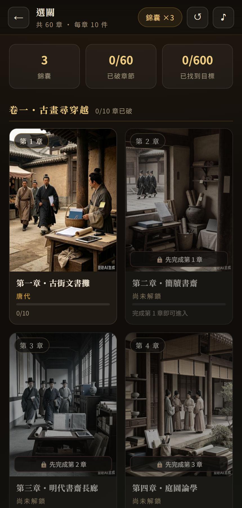
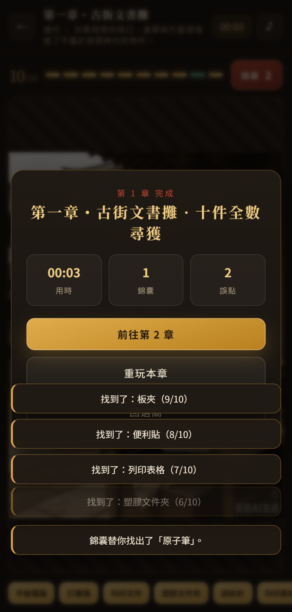
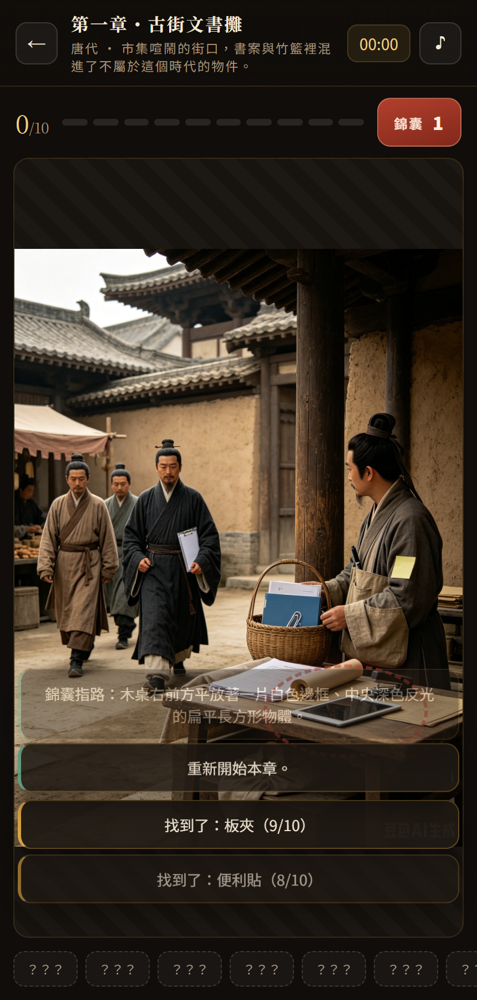
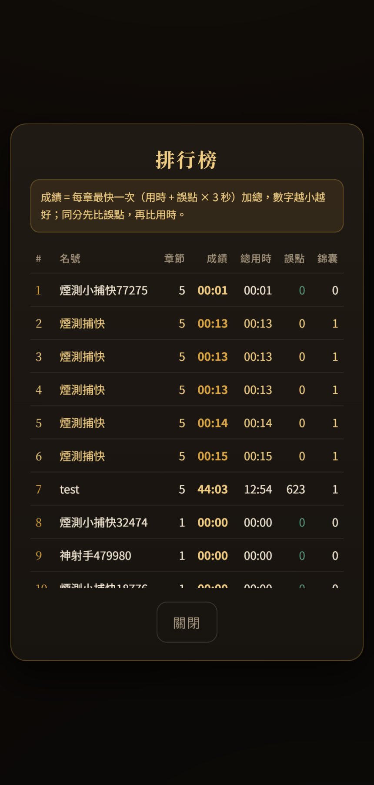
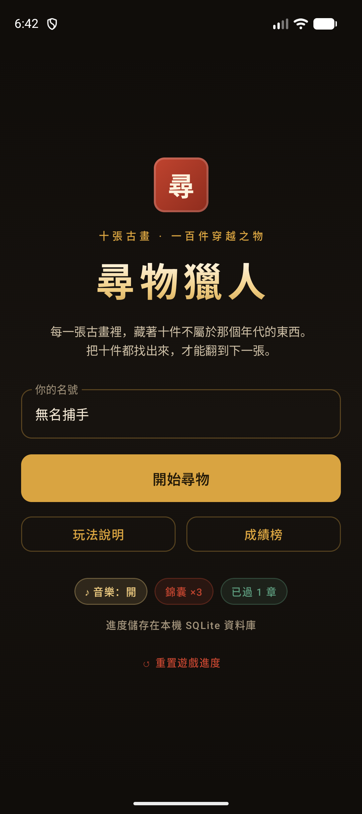
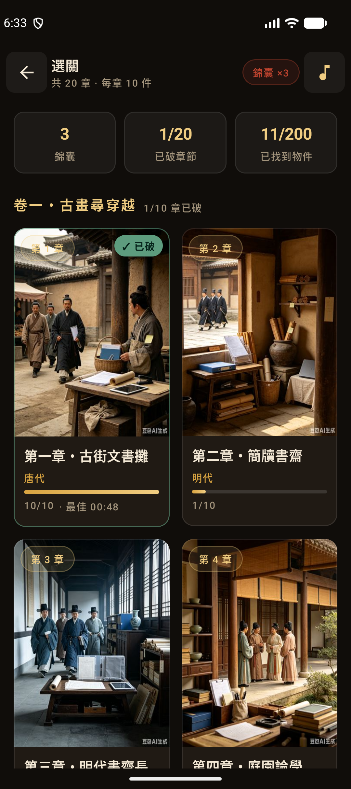
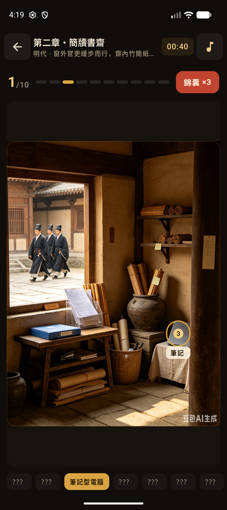
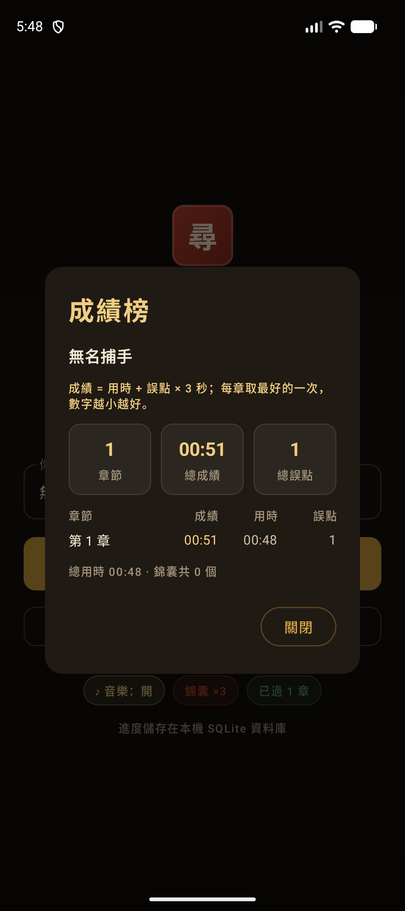
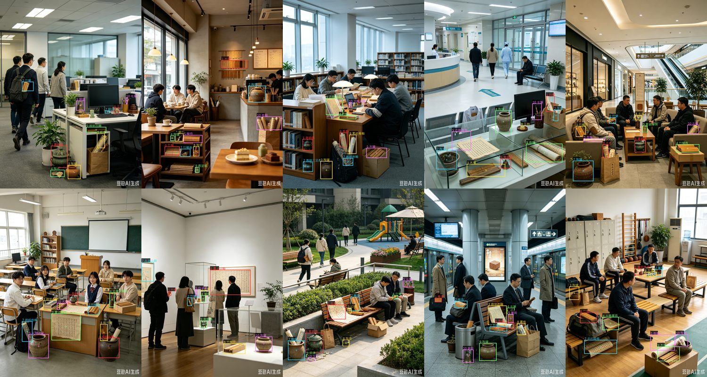

# 尋物獵人 Photo Hunter

在相片裡找出不屬於那個年代的東西。

每一關是一張相片，畫面裡藏了 **10 件不屬於那個年代的物件**；把十件全部找出來才能過關。
遊戲預設給你 **3 個錦囊**，每個錦囊可以「**自動尋物**」（直接找出 1 件）或「**提示位置**」（在相片上圈出 1 件的位置 5 秒）。
成功過 **5 關** 會再獲得 **3 個錦囊**（過 10 關再 3 個）。有背景音樂，找到物件時有音效。

遊戲分成兩卷，題材剛好相反：

| 卷 | 章 | 相片 | 要找的十件東西 |
|---|---|---|---|
| **卷一・古畫尋穿越** | 第 1–10 章 | 古代場景（吉卜力風） | **現代物件**跑進了古代 |
| **卷二・今世覓古物** | 第 11–20 章 | 現代真人風格照片 | **古代文物**被現代人穿戴、攜帶、擺放 |

> **目前狀態**：卷一（第 1–10 章）已完成並在兩個 App 上運作。
> 卷二需要 10 張相片，`images2/` 目前有 8 張，等 10 張到齊才會一次接上（第 11–20 章）。

同一個遊戲做了兩個版本：

| | Web 版 | Android 版 |
|---|---|---|
| 前端 | 原生 ES Module SPA（免建置） | Kotlin + Jetpack Compose (Material 3) |
| 後端 | Node.js + Express（REST API） | 無（單機） |
| 資料庫 | **MySQL 8（Docker）** | **SQLite（Room）** |
| 進度 | 存在 MySQL，換裝置／重開瀏覽器都還在 | 存在手機本機資料庫 |
| 音訊 | WebAudio（背景音樂 + 音效） | MediaPlayer + SoundPool |

兩個版本吃同一份關卡資料（`shared/levels/*.json`）與同一份素材，所以每一關的十件物品與命中框完全一致。

## 畫面

| Web 版選關 | Web 版過關結算（含本章成績） | Web 版提示位置 |
|---|---|---|
|  |  |  |

| Web 版排行榜 | Android 首頁 | Android 選關 |
|---|---|---|
|  |  |  |

| Android 遊戲中 | Android 成績榜 |
|---|---|
|  |  |

十關的命中框人工複核（每一格是該關相片加上十個框）：


卷二已標註完成的 8 關（第 11–18 章，尚未上線）：



---

## 目錄

- [快速開始](#快速開始)
- [關卡與素材](#關卡與素材)
- [遊戲規則](#遊戲規則)
- [Web 版](#web-版)
  - [啟動 MySQL + API](#啟動-mysql--api)
  - [資料庫結構](#資料庫結構)
  - [API 一覽](#api-一覽)
  - [全部用 Docker 跑](#全部用-docker-跑)
  - [測試](#測試)
- [Android 版](#android-版)
- [工具鏈](#工具鏈)
- [新增或修改關卡](#新增或修改關卡)
- [驗證結果](#驗證結果)

---

## 快速開始

```powershell
# Web 版（需要 Docker Desktop 與 Node.js 20+）
cd web
docker compose up -d db        # MySQL 8，host port 3307
npm install
npm start                      # http://127.0.0.1:4000/

# Android 版（需要 Android SDK；JDK 17+）
cd android
.\gradlew.bat assembleDebug      # app\build\outputs\apk\debug\app-debug.apk
.\gradlew.bat testDebugUnitTest  # 排名規則等單元測試
```

> MySQL 在 Docker 裡用 **3307**（不是 3306），因為這台機器上已經有其他專案的容器佔用 3306。
> 要改的話編輯 `web/.env` 的 `MYSQL_PORT` / `DB_PORT` 即可（兩個要一致）。

---

## 關卡與素材

```
images/                        卷一 10 張原始相片（1728×2304，未經修改）
images2/                       卷二相片（現代真人風格，需要 10 張，目前 8 張）
shared/
  levels/level-XX.json         關卡資料：卷別、標題、年代、10 件物品、命中框（唯一真相來源）
  levels/SCHEMA.md             資料格式說明
  assets/images/*.jpg          出貨用相片 1440×1920 + 360×480 縮圖
  assets/audio/*.wav           程式產生的背景音樂與音效
web/                           Web 版（Express API + MySQL + SPA）
android/                       Android 版（Compose + Room）
tools/                         素材產生、驗證與標註工具
```

**卷一・古畫尋穿越**（每一關都是 `images/` 裡的一張相片）：

| 章 | 標題 | 照片年代 | 要找的十件 | 相片 |
|---|---|---|---|---|
| 1 | 第一章・古街文書攤 | 唐代 | 現代物件 | `生成吉卜力风格古代照片.png` |
| 2 | 第二章・簡牘書齋 | 明代 | 現代物件 | `…(1).png` |
| 3 | 第三章・明代書齋長廊 | 明代 | 現代物件 | `…(2).png` |
| 4 | 第四章・庭園論學 | 唐代 | 現代物件 | `…(3).png` |
| 5 | 第五章・學堂晨讀 | 清末 | 現代物件 | `…(4).png` |
| 6 | 第六章・草原氈帳 | 蒙古帝國時期 | 現代物件 | `…(5).png` |
| 7 | 第七章・帳房核帳圖 | 清末 | 現代物件 | `…(6).png` |
| 8 | 第八章・書齋論道 | 明代 | 現代物件 | `…(7).png` |
| 9 | 第九章・官衙議事庭院 | 明代 | 現代物件 | `…(8).png` |
| 10 | 第十章・清代官署書房 | 清代 | 現代物件 | `…(9).png` |

**卷二・今世覓古物**（現代照片裡找古代文物）— 等 `images2/` 收齊 10 張後接上，章號為 11–20。
`tools/prepare_assets.py` 已把章號與檔名綁定（`PINNED`），之後新增相片只會往後追加章號，不會動到既有標註。

每一件物品在 JSON 裡的位置是**正規化命中框** `bbox = [x, y, w, h]`（0～1，原點在左上角），
所以同一組數字在瀏覽器、手機、任何螢幕尺寸上都對得上。

---

## 遊戲規則

| 規則 | 值 | 說明 |
|---|---|---|
| 每關物件數 | 10 | 找齊 10 件即過關 |
| 起始錦囊 | 3 | 新玩家一開始就有 |
| 里程碑 | 每 5 關 | 完成 5 關 +3 個錦囊，完成 10 關再 +3 |
| 錦囊用法 | `reveal` / `locate` | 自動尋物（算入十件）或提示位置（只圈出位置 5 秒） |
| 錯誤點擊 | 不扣分、但影響排名 | 記錄在成績裡，並折算成排行榜的罰時 |
| 排名成績 | 用時 + 誤點 × 3 秒 | 數字越小越前面（罰時可用 `WRONG_TAP_PENALTY_MS` 調整） |

### 排行榜怎麼算

> **成績 = 用時 + 誤點 × 3 秒**，每章取**最好的一次**加總；先比完成章節數，再比成績。

- 只看**完成的挑戰**（`play_sessions.completed = 1` 且有計時），所以既獎勵**快**、也獎勵**不亂點**。
- 每一章取該玩家**最好的一次成績**，所以重玩可以刷新紀錄；但「已過關數」與錦囊里程碑只算第一次破關，不能用重玩刷錦囊。
- 同分時的順序：**誤點少** → 總用時短 → 錦囊用得少。
- **錦囊刻意不計入成績**，只用來當最後的排序參考，避免「用錦囊省時間」反而變成最佳策略。
- 罰時是設定值（`web/.env` 的 `WRONG_TAP_PENALTY_MS`，預設 3000），Android 版用同一個數字，兩邊的成績可以直接比較。
- Web 版的排名查詢用 MySQL 8 的 window function 取「每章最佳一次」，再彙總排序（見 `web/server/routes.js` 的 `/api/leaderboard`）。
- Android 版沒有伺服器，所以是**本機成績榜**：用 SQLite 的 `sessions` 表以同一條公式排出每章最佳成績（規則寫在 `RankingCalculator`，有單元測試）。

**錦囊不會被刷**：重玩已過關的章節會重新開始這一關（相片重置成 0/10），但「已過關數」與錦囊獎勵只算**第一次**破關，
所以沒辦法用重玩來量產錦囊。Web 版由伺服器決定這件事，Android 版由資料庫的 `completed` 欄位（單調遞增）決定。

**命中判定**：點擊點落在 `bbox` 內就算找到；每個框會先長到最小可點大小（約畫面寬 2.6% / 高 2.2%），
再加上手指容錯（左右 1.4%、上下 1.2%）。如果一個小物件疊在大物件上，**面積最小的框優先**，
因為玩家瞄準的是那個小東西。

---

## Web 版

### 啟動 MySQL + API

```powershell
cd web
copy .env.example .env         # 第一次才需要
docker compose up -d db        # 只跑資料庫
npm install
npm start                      # API + 前端 http://127.0.0.1:4000/
```

打開 <http://127.0.0.1:4000/> 就會看到遊戲。伺服器啟動時會：

1. 讀 `web/data/levels/level-*.json`（由 `tools/sync_levels.py` 從 `shared/levels/` 同步過來）
2. 冪等地建立／升級資料表（`web/db/schema.sql`）
3. 把 10 關 / 100 件物品寫進 MySQL（`levels`、`level_objects`）
4. 掛上 REST API 與靜態前端

`docker compose up -d db` 跑的是 MySQL 8，資料存在具名 volume `photo-hunter_mysql-data`，
`docker compose down -v` 可以整個重來。

### 資料庫結構

`web/db/schema.sql`（同時掛進容器的 `docker-entrypoint-initdb.d`，每次開機也會冪等套用一次）：

| 表 / 檢視 | 用途 |
|---|---|
| `levels` | 十個章節的標題、年代、圖片、物件數 |
| `level_objects` | 每章 10 件物品：名稱、原因、提示、正規化 bbox |
| `players` | 玩家（用 localStorage 的 UUID 當 key）、錦囊數、已過關數、總用時 |
| `level_progress` | 每玩家每章的進度：`found_objects`（JSON）、完成狀態、最佳時間、誤點 |
| `play_sessions` | **每一次挑戰**（毫秒精度 `DATETIME(3)`）：用時、誤點、錦囊、是否過關 — 排行榜的資料來源 |
| `hint_grants` | 錦囊**獲得**的稽核記錄（哪個里程碑、幾個） |
| `hint_events` | 錦囊**花費**的稽核記錄（哪一關、哪一件、`reveal`/`locate`） |
| `leaderboard`（view） | 每位玩家的累計統計（章節、物件、總時、錦囊） |

### API 一覽

| Method | Path | 說明 |
|---|---|---|
| GET | `/api/health` | 服務與 MySQL 狀態（章節數、物件數、玩家數） |
| GET | `/api/config` | 遊戲規則 |
| POST | `/api/players` | 建立玩家（拿到 `playerKey`），發 3 個錦囊 |
| GET | `/api/players/:key` | 玩家資料 + 各章進度 |
| PATCH | `/api/players/:key` | 改名 |
| GET | `/api/levels?player=` | 章節清單（含該玩家進度） |
| GET | `/api/levels/:id?player=` | 單章完整資料（含 10 件物品與 bbox） |
| POST | `/api/players/:key/levels/:id/start` | 開始（可帶 `restart:true` 重玩）→ 回 `sessionId` |
| POST | `/api/players/:key/levels/:id/found` | 回報找到一件（`objectId`），第十件自動結算 |
| POST | `/api/players/:key/levels/:id/miss` | 回報一次誤點 |
| POST | `/api/players/:key/levels/:id/hint` | 使用錦囊（`mode: reveal \| locate`），**伺服器**挑目標並扣錦囊 |
| GET | `/api/leaderboard` | 排行榜：依「完成章節數 ↓、成績 ↑（用時 + 誤點 × 罰時）、誤點 ↑」排序，另回 `scoring` 說明計分方式 |

伺服器是權威來源：錦囊數量、過關判定、里程碑獎勵都由伺服器算，前端只負責畫面與回報點擊。

### 全部用 Docker 跑

```powershell
docker compose --profile full up -d --build   # MySQL + API 容器，http://127.0.0.1:4000/
docker compose --profile full down
```

### 測試

```powershell
cd web
npm run smoke        # 57 項 API / 資料庫 / 遊戲規則 / 排名端到端檢查（需要伺服器已啟動）
npm run ui-check     # 32 項真實瀏覽器（headless Chrome）操作檢查，並輸出截圖
npm run probe:replay # 確認重玩不會重複計算進度
```

`ui-check` 用 `puppeteer-core` 驅動本機已安裝的 Chrome／Edge（不另外下載 Chromium），
會真的點擊相片、用錦囊、過 5 關拿獎勵、重新載入頁面確認 MySQL 進度還在，
截圖存到 `web/scripts/screenshots/`。

---

## Android 版

```
android/
  app/src/main/
    assets/levels/*.json        10 關資料（由 tools/sync_levels.py 同步）
    assets/images/*.jpg         相片與縮圖
    res/raw/*.wav               背景音樂與音效（檔名已改成 Android 允許的底線格式）
    java/com/photohunter/game/
      MainActivity.kt           single-activity Compose
      PhotoHunterApp.kt         畫面切換、音訊、計時、返回鍵、對話框
      GameViewModel.kt          遊戲狀態與規則（UiState / DialogState / Sfx）
      data/                     Room：Entities / Dao / Database / Repository / LevelCatalog
      game/                     GameRules（命中判定，與網頁版同一套） / AudioController
      ui/                       Theme / HomeScreen / ChapterSelectScreen / GameScreen / Dialogs
```

```powershell
cd android
.\gradlew.bat assembleDebug            # 產出 app\build\outputs\apk\debug\app-debug.apk
.\gradlew.bat installDebug             # 安裝到已連線的裝置／模擬器
.\gradlew.bat assembleRelease          # 產出已簽署的 app\build\outputs\apk\release\app-release.apk
```
**To install the release APK on a device:**

```bash
adb install app/build/outputs/apk/release/app-release.apk
```

Release 版已用專案內的金鑰庫簽署（`android/app/photohunter-release.keystore`，alias `photohunter`），
可直接安裝到手機或上架。金鑰庫密碼與金鑰密碼都是 `photohunter123`。

> **注意**：金鑰庫檔案已加入 `.gitignore`，不會被提交到 Git。請務必備份此檔案，
> 遺失後將無法再為同一簽署憑證更新應用程式。

- **SQLite（Room）**：`photo_hunter.db`，資料表對應 Web 版的 MySQL 結構
  （`players`、`levels`、`level_objects`、`progress`、`sessions`、`hint_events`、`hint_grants`、`meta`）。
  首次啟動時從 `assets/levels/*.json` 播種章節，之後只讀資料庫；關卡資料換版本時會自動重新播種。
- **成績榜**：沒有伺服器，所以是**本機成績榜**——用 `sessions` 表以同一條公式
  （用時 + 誤點 × 3 秒）排出每章最佳成績，並在過關結算顯示「本章成績」與「本章最快紀錄」。
  規則寫在純 Kotlin 的 `RankingCalculator`，附 7 個單元測試（`gradlew testDebugUnitTest`）。
- **音訊**：背景音樂用 `MediaPlayer` 循環播放（選單／關卡各一首），音效用 `SoundPool`（可重疊），
  離開前景會自動暫停、回來自動續播，右上角可靜音。
- **命中判定**：與網頁版完全相同的 `GameRules.hitTest`，相片以 `BoxWithConstraints` 依 3:4 等比縮放，
  點擊座標除以實際繪製尺寸得到正規化座標，所以標記與命中框在任何螢幕都對齊。
- **計時／返回鍵**：`BackHandler` 讓返回鍵從遊戲回選關、再回首頁。

---

## 卷二上線步驟（等 `images2/` 收齊 10 張後執行）

`tools/sync_levels.py` 有保護：只要有任何一關的相片還沒產生，它就會拒絕同步並列出缺哪幾張，
所以卷二不可能在資料不齊的狀態下被推上線。收齊後照順序跑：

```powershell
# 1. 標註第 19、20 章（新增 shared/levels/level-19.json、level-20.json）
#    用 tools/annotate_helper.py 的 grid/crop/overlay/one 量測與複核
py tools\validate_levels.py                     # 全部關卡都要 OK

# 2. 產生相片素材（images2/ 的照片會自動接到第 11 章之後）
py tools\prepare_assets.py                      # 加 --strict 可在缺相片時直接失敗

# 3. 同步關卡資料到 web 與 android
py tools\sync_levels.py

# 4. Web：重啟 API（開機會重新播種 MySQL 並長出新的章節）
cd web; npm start
npm run check                                   # smoke 48+ 項 + 真實瀏覽器 UI 檢查

# 5. Android：重新建置並安裝
cd ..\android; .\gradlew.bat assembleDebug installDebug
```

App 端不需要改程式就能容納 20 章（選關格線、進度統計、每 5 關的錦囊里程碑都是資料驅動的），
唯一建議一起做的是「卷別標題」：關卡 JSON 已經有 `collection` 欄位，
可以在選關畫面依卷分組顯示（`卷一・古畫尋穿越` / `卷二・今世覓古物`）。

---

## 工具鏈

`tools/` 底下的 Python 工具（需要 Pillow）：

| 指令 | 用途 |
|---|---|
| `py tools/prepare_assets.py` | 把 `images/`（卷一）與 `images2/`（卷二）的原始相片轉成 1440×1920 主圖 + 360×480 縮圖，並同步到 web 與 android；缺相片會警告並跳過（`--strict` 則直接失敗） |
| `py tools/generate_audio.py` | 用程式合成背景音樂（32 秒無接縫循環）與 7 個音效，輸出 WAV |
| `py tools/generate_android_icons.py` | 產生 Android 各密度啟動圖示 PNG |
| `py tools/sync_levels.py` | 把 `shared/levels/*.json` 同步到 `web/data/levels` 與 Android assets |
| `py tools/validate_levels.py` | 驗證關卡 JSON：10 件、id 順序、bbox 範圍與大小、框重疊、提示洩題等 |
| `py tools/annotate_helper.py` | 標註輔助：`info` / `grid` / `crop` / `overlay` / `one` |

音訊是**完全用程式產生**的（正弦波、泛音堆疊、包絡、Schroeder 殘響），沒有任何下載的素材；
背景音樂用「尾段折疊」方式做成無接縫循環，所以接點不會有喀噠聲。

---

## 新增或修改關卡

1. 把相片放進對應的卷別資料夾（`images/` = 卷一、`images2/` = 卷二；3:4 直式最好）。
2. 撰寫 `shared/levels/level-XX.json`（格式見 `shared/levels/SCHEMA.md`）。
   用 `py tools/annotate_helper.py crop …` 放大局部量測像素座標，換算成正規化 `bbox`，
   再用 `py tools/annotate_helper.py overlay …` 把框畫回圖上確認每一個框都貼著目標。
3. `py tools/validate_levels.py` 必須全部通過。
4. `py tools/prepare_assets.py`（新相片）與 `py tools/sync_levels.py`（關卡資料）。
5. Web：重啟 API（開機會重新播種 MySQL）。Android：重新建置 APK。

卷二的題材是相反的：相片是**現代場景**，要找的是**古代文物**（青銅鼎、竹簡、卷軸、陶罐、玉珮…）。
寫 `reason` 時要說明「這件古物為什麼不該出現在現代場景」，`era` 則填照片本身的年代（例如 `現代（約 2020 年代）`）。

---

## 驗證結果

| 項目 | 結果 |
|---|---|
| 關卡資料驗證 | `validate_levels.py`：**18 個檔案全部 OK**（卷一 10 關已上線、卷二 8 關待上線） |
| 標註品質 | 已上線 10 關 + 卷二 8 關，都做過人工複核 overlay：每個命中框都貼在目標物件上（見上方拼圖） |
| Web API / DB 端到端 | `npm run smoke` → **57/57**（含排名：乾淨通關的名次贏過手滑通關） |
| Web 真實瀏覽器操作 | `npm run ui-check` → **32/32**（含過 5 關拿 3 個錦囊、排行榜欄位與計分說明） |
| 重玩不重複計算 | `npm run probe:replay` → OK |
| Android 排名規則 | `gradlew testDebugUnitTest` → **7/7**（成績公式、每章取最佳、重玩刷新紀錄、同分比序） |
| 全 Docker 堆疊 | `docker compose --profile full up -d --build` → api 容器 healthy，smoke **48/48**、ui-check **28/28** |
| Android 建置 | `gradlew assembleDebug` → BUILD SUCCESSFUL，`app-debug.apk`（約 24 MB） |
| Android Release | `gradlew assembleRelease` → BUILD SUCCESSFUL，`app-release.apk`（約 18 MB，已簽署，含成績榜） |
| Android 實際執行 | 安裝到 Android 17（API 37）模擬器：首頁 → 選關 → 進關 → 點擊尋物 → 過關結算（顯示本章成績與最快紀錄）→ 成績榜，標記／提示／音效正常，無 crash |

開發過程中修掉的四個真實缺陷（都已被上表的測試涵蓋）：

1. **重玩會重複計算過關數**：回報找到物件時把 `completed` 一起寫回 0，導致重玩時又把同一關算一次，
   錦囊里程碑可以被刷。改成 `completed = GREATEST(completed, ?)`（單調遞增），並讓「重玩」只重置相片進度。
2. **用時精度只有 1 秒**：`play_sessions.started_at` 是 `DATETIME`，同一秒內過關會記成 0 毫秒。改成 `DATETIME(3)` + `NOW(3)`。
3. **錦囊回應不一致**：重複點已找到的物件時，回應少了 `foundCount` 欄位。
4. **沒帶 sessionId 就不會進排行榜**：客戶端若忘了送 `sessionId`，那一章的挑戰不會被標記完成，
   成績永遠不會出現在排行榜上。改成伺服器自己找出該玩家在該關最新一筆未結束的挑戰（`resolveSessionId`），
   `/found`、`/miss`、`/hint` 都適用。
